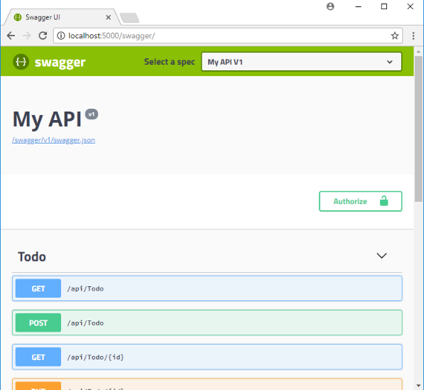

# Propuesta Técnica para Desarrollo de API Utilizando OpenAPI en Node.js

## Resumen y necesidad
    Este documento describe la propuesta técnica para el desarrollo de una API utilizando **Node.js** y **OpenAPI (Swagger)** que permitirá a varios clientes (por ejemplo, Adosa, Chevrolet, Ampars, entre otros) realizar operaciones relacionadas con la carga y gestión de archivos en un **bucket de Amazon S3**. Cada cliente tendrá su propio conjunto de controladores y firmas específicas para diferentes tipos de operaciones.

## Objetivos

- Desarrollar una API robusta y **segura** que permita a los clientes interactuar con un bucket de Amazon S3.
- Utilizar **OpenAPI** para definir la estructura y documentación de la API, facilitando la comprensión y uso por parte de los desarrolladores.
- Implementar un sistema de autenticación basado en tokens para asegurar la privacidad y la seguridad de los datos.

## Tecnologías Utilizadas

- Node.js como entorno de desarrollo.
- Express.js como framework para la creación de la API.
- OpenAPI (Swagger) para la definición de la API y la generación de la documentación.
-Amazon S3 como servicio de almacenamiento de archivos.

## Estructura de la API

- La API se organizará en conjuntos de controladores separados para cada cliente (Adosa, Chevrolet, Ampars, etc.).
- Cada conjunto de controladores contendrá varias rutas que corresponderán a diferentes firmas (producto, producto tienda, inventario, consumo diario, etc.).

## Autenticación y Autorización

- Se implementará un sistema de autenticación basado en tokens.
- Cada cliente recibirá un token único que se utilizará para autenticar las solicitudes a la API.
- Los tokens serán almacenados y gestionados de forma segura en la base de datos.
- 

    Ejemplo
    Cargar un Archivo de Producto para el Cliente Adosa:

    Ruta: https://{servidor}/Adosa/Producto
    Método: POST
    Header: Autoritation: Bearer {token}
    Cuerpo de la Solicitud: Archivo de producto a cargar.

## Documentación

- Se generará documentación automática utilizando OpenAPI (Swagger).
- La documentación detallará las rutas disponibles, los parámetros requeridos, las respuestas posibles y ejemplos de uso.
- ejemplo 
    

## Seguridad

- Se implementarán medidas de seguridad para proteger la API contra ataques comunes, como inyecciones de SQL y ataques de fuerza bruta.
- Se configurarán políticas de acceso en Amazon S3 para garantizar que solo los usuarios autorizados puedan cargar y acceder a los archivos.

## Flujo de Trabajo

- Los clientes obtienen su token de autenticación.
- Los clientes utilizan el token para realizar solicitudes a la API.
- La API verifica la autenticidad del token y procesa la solicitud según la firma y el cliente.
- Las operaciones en la API interactúan con Amazon S3 para realizar las acciones solicitadas (cargar, gestionar archivos, etc.).
- Se devuelve una respuesta a la solicitud, incluyendo códigos de estado y, en su caso, datos relevantes.

## Conclusión
- La propuesta técnica describe la creación de una API en Node.js que permitirá a varios clientes interactuar con un bucket de Amazon S3. 
- El uso de OpenAPI y un sistema de autenticación basado en tokens garantiza la seguridad y la comprensión de la API. 
- La implementación se llevará a cabo siguiendo las mejores prácticas de desarrollo y seguridad.

## Enlaces de interes
- [Qué es Swagger?](https://www.chakray.com/es/swagger-y-swagger-ui-por-que-es-imprescindible-para-tus-apis/)
- [Crear api con Node js](https://juanda.gitbooks.io/webapps/content/api/creacion_de_una_api_con_nodejs.html)
- [Ejemplo de creación de api](https://www.youtube.com/watch?v=bK3AJfs7qNY&t=2s)
- [Documenting a Node.js REST API using Swagger](https://www.section.io/engineering-education/documenting-node-js-rest-api-using-swagger/)
- [Interacción entre Node y AWS](https://docs.aws.amazon.com/es_es/sdk-for-javascript/v2/developer-guide/s3-node-examples.html)